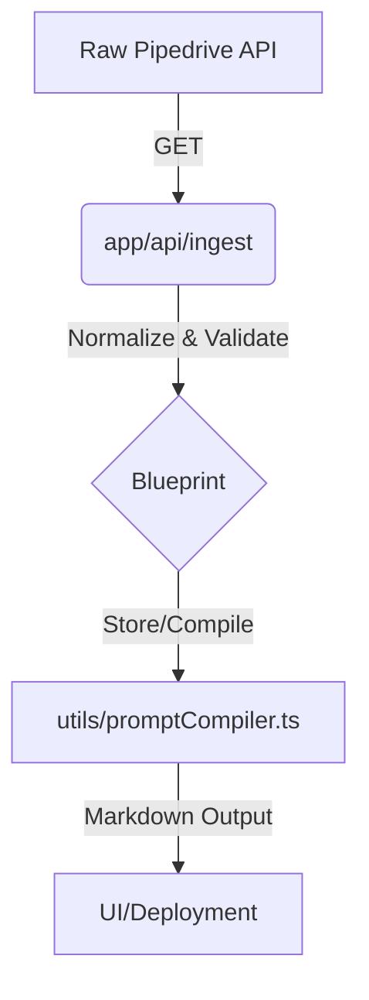

# Architecture Overview

The Rosewood Engine is a modular application built on Next.js, utilizing specialized directories for core functionalities.

## Folder Structure

- `app/`: Next.js App Router definitions.
    - `api/`: API routes for engine operations (`compile-agent`, `deploy`, `ingest`).
    - `vault/`: Protected or specialized view routes.
- `config/`: Application configuration, including capability definitions (`pipedriveCapabilities.json`).
- `data/`: Data storage and definitions (e.g., blueprints).
- `docs/`: Project documentation.
- `types/`: Shared TypeScript type definitions.
- `utils/`: Core engine logic and helper functions.
    - `docxExporter.ts`: Export utility.
    - `fileSerializer.ts`: Data serialization logic.
    - `promptCompiler.ts`: Compiler logic for engine prompts.

## Data Flow

1.  **Ingestion**: Raw data enters through `app/api/ingest`.
2.  **Processing**: Engine utilities (`utils/`) parse and compile data into structured blueprints.
3.  **Visualization/Deployment**: Compiled data is surfaced through the UI (`app/`) or deployed via `app/api/deploy`.

## Configuration Management

Pipedrive capabilities are managed in `config/pipedriveCapabilities.json`. This approach separates configuration data from core application logic, facilitating easier updates and potential future UI-based configuration management.

### Updating Capabilities
1.  Modify `config/pipedriveCapabilities.json` directly.
2.  Ensure changes adhere to the `PipedriveCapabilitiesRegistry` type defined in `types/blueprint.ts`.
3.  The application will automatically pick up changes as it imports this file through `config/pipedriveCapabilities.ts`.
